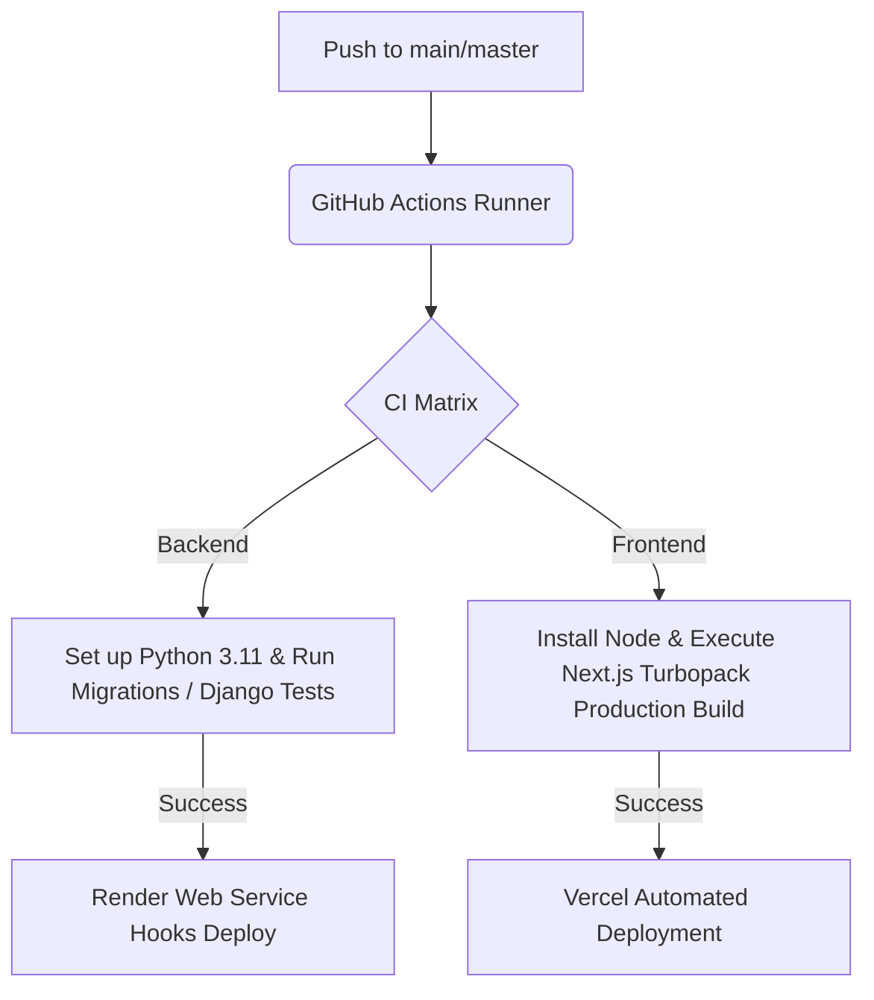

<<<<<<< HEAD
# Amulya Anamdasu — AI/ML Engineer • Full-Stack Developer 

A modern, interactive portfolio built to showcase my journey as an **AI/ML Engineer**, **Full-Stack Developer**, and **two-time Smart India Hackathon Finalist**. The portfolio combines immersive UI, 3D graphics, smooth animations, and a scalable backend to present projects, research, achievements, and technical expertise in a premium product experience.

The application is designed with a clean, futuristic aesthetic inspired by modern technology products while maintaining good performance, accessibility, and responsiveness across all devices.

---

# 🌐 Live Portfolio

**Portfolio:** https://amulya-portfolio-livid.vercel.app

---

# 🛠 Tech Stack

## Frontend

- Next.js 15
- React 19
- TypeScript
- Tailwind CSS v4
- Three.js
- React Three Fiber
- React Drei
- Framer Motion
- GSAP
- Lenis

## Backend

- Django
- Django REST Framework
- Simple JWT
- PostgreSQL
- SQLite

## DevOps

- Docker
- GitHub Actions
- Vercel

---

# 📂 Project Structure

```text
Portfolio/
│
├── backend/
│   ├── portfolio_api/
│   ├── core/
│   ├── projects/
│   ├── skills/
│   ├── achievements/
│   ├── certifications/
│   ├── experience/
│   ├── contact/
│   ├── analytics/
│   └── blog/
│
├── src/
│   ├── app/
│   ├── components/
│   ├── hooks/
│   ├── lib/
│   ├── styles/
│   └── utils/
│
├── public/
├── .github/
├── package.json
├── vercel.json
└── README.md
=======
# Amulya Anamdasu — Interactive AI/ML & Full-Stack Developer Portfolio

[](https://amulya-portfolio-livid.vercel.app)
[](https://github.com/Amu612)
[](https://nextjs.org/)
[](https://www.djangoproject.com/)

A world-class, premium, progressive web application (PWA) portfolio experience engineered for **Amulya Anamdasu** (AI/ML Developer, Full-Stack Engineer, and two-time Smart India Hackathon Finalist). Designed with an immersive, interactive technology product launch aesthetic—drawing inspiration from Apple Vision Pro, Stripe's fluid interactions, and Vercel's clean design systems.

---

## 🔗 Live Deployments

*   **Frontend (PWA):** [amulya-portfolio-livid.vercel.app](https://amulya-portfolio-livid.vercel.app)
*   **Resume Link:** [Google Drive Resume](https://drive.google.com/file/d/1zIw4kQ4kcqzSZ1F6pH3m_rlnqvNdl2No/view?usp=sharing)
*   **Backend REST API:** [portfolio-api (Render configuration ready)](./backend/render.yaml)

---

## 🌌 Core Architectural Features

### 1. 3D Global Depth System & Core Visuals
*   **Interactive 3D Neural Core:** Built with React Three Fiber (R3F) and `@react-three/drei`. Features a mathematically sound, pulsing distorted outer shell, dynamic inner glowing core, and orbiting holographic rings that respond directly to cursor movements.
*   **Zero-NaN Particle Fields:** A customized `maath/random` background matrix operating at exactly `6000` float values (guaranteeing exact divisibility by 3) to prevent bounding sphere computation issues.
*   **Smooth Motion & Depth:** Complete scroll integration with **Lenis Smooth Scroll** and viewport-based animate-on-scroll handlers using **Framer Motion** and **GSAP ScrollTrigger**.

### 2. Tailored Custom Cursor System
*   **Dual-Element Physics Trail:** A dynamic custom pointer featuring a high-stiffness inner dot and a damped lag-following outer ring to emphasize velocity.
*   **Smart Hover States:** Automatically detects interactive targets (`button`, `a`, custom triggers) to morph size, adjust opacity, and emit subtle glow filters.

### 3. Progressive Web App (PWA) & Performance
*   **Lighthouse Optimized:** Strict security headers and redirects configured via `vercel.json`.
*   **Offline-Ready:** Web app manifest configured in `src/app/manifest.ts` featuring optimized icon mapping and immersive fullscreen display mode.
*   **GPU Acceleration:** Styled natively in **Tailwind CSS v4** utilizing hardware-accelerated transforms for fluid 60fps renders on mobile and desktop.

### 4. Fully Structured Django REST Backend
*   **Domain-Driven Apps:** Clean separation of concerns with Django apps: `core`, `projects`, `blog`, `skills`, `experience`, `achievements`, `certifications`, `contact`, and `analytics`.
*   **RESTful endpoints:** Exposed at `/api/v1/` using Django REST Framework (DRF) viewsets, complete with filtering capabilities.
*   **Secure Authentication:** Integrated JWT (JSON Web Tokens) via `djangorestframework-simplejwt` for admin state updates.
*   **Seeding Automation:** Custom management command to automatically populate full-stack and machine learning experience databases.

---

## 🛠️ Technology Stack

| Component | Technology | Description |
| :--- | :--- | :--- |
| **Frontend Core** | Next.js 15 (App Router), React 19, TypeScript | High-performance React framework with Turbopack compiler. |
| **Styling** | Tailwind CSS v4, Vanilla CSS | CSS variables mapped using Tailwind's new `@theme` directives. |
| **3D Rendering** | Three.js, React Three Fiber (R3F), `@react-three/drei` | Custom WebGL canvas rendering neural particle clouds. |
| **Animations** | GSAP, Framer Motion, Lenis Scroll | Scroll storytelling, typography transitions, custom cursor physics. |
| **Backend Core** | Django, Django REST Framework (DRF) | Secure Python web framework with routing and serialization. |
| **Auth** | SimpleJWT (JSON Web Tokens) | Stateless endpoint protection. |
| **Database** | PostgreSQL (Prod Ready), SQLite (Dev Local) | Relational database modeling projects, skills, and metrics. |
| **DevOps & CI** | Docker, GitHub Actions, Render, Vercel | Automatic CI pipelines, multi-container configurations. |

---

## 📂 Project Directory Structure

```filepath
Amulya_Portfolio/
├── .github/
│   └── workflows/
│       └── ci.yml               # GitHub Actions CI pipeline configuration
├── backend/                     # Django API Backend
│   ├── portfolio_api/           # Root Django project folder (Settings, URLs)
│   ├── core/                    # SiteSettings, Resume, SocialLink apps & seeding commands
│   ├── projects/                # Rich models and serializers for detailed projects
│   ├── skills/                  # Floating skill catalog datasets
│   ├── blog/                    # Article publishing and filtering system
│   ├── contact/                 # Message logging for contact terminal
│   ├── manage.py                # Django CLI executor
│   ├── requirements.txt         # Production python dependency manifest
│   └── render.yaml              # Gunicorn web service deploy specs
├── src/                         # Next.js 15 Frontend source
│   ├── app/                     # Next.js App Router (Layouts, Global Styles)
│   └── components/              # Interactive UI and R3F Canvas components
│       ├── canvas/
│       │   └── HeroCanvas.tsx   # Three.js 3D Particle & Neural Core System
│       ├── CustomCursor.tsx     # Custom cursor spring physics
│       └── RevealAnimations.tsx # Dynamic scroll in-view animations
├── package.json                 # Node dependencies
├── vercel.json                  # Vercel deployment & security header settings
└── README.md                    # Project documentation
>>>>>>> 2a145c7 (Update portfolio homepage and backend seed data)
```

---

<<<<<<< HEAD
# 🚀 Features

## Interactive Hero

- 3D Neural Core
- Dynamic particle system
- Mouse-responsive interactions
- Animated lighting and depth

## Modern User Experience

- Custom animated cursor
- Scroll-triggered animations
- Smooth page transitions
- Interactive project showcase
- Elegant typography
- Responsive layouts

## Performance

- Optimized rendering
- GPU-accelerated animations
- Lazy loading
- Image optimization
- Progressive Web App support
- Lighthouse-friendly configuration

---

# 💼 Featured Projects

The portfolio showcases several AI, Machine Learning, Full-Stack, and Geospatial projects, including:

- InsightAI
- CO₂ Digital Twin Dashboard
- GeoAnushasan
- VillageCraft
- Learning Path Recommendation System
- Greenwashing Detector
- BLemish

Each project includes detailed descriptions, technologies used, challenges solved, and interactive visual presentations.

---

# ⚙️ Running Locally

## Clone the repository

```bash
git clone <repository-url>
cd <repository-folder>
```

---

## Backend

```bash
cd backend

python -m venv venv

# Windows
venv\Scripts\activate

# macOS/Linux
source venv/bin/activate

pip install -r requirements.txt

python manage.py migrate

python manage.py runserver
```

---

## Frontend

```bash
npm install

npm run dev
```

The application will be available locally at:

```
http://localhost:3000
```

---

# 👨‍💻 About Me

I'm an AI/ML Engineer and Full-Stack Developer passionate about building intelligent applications, immersive web experiences, and scalable software systems. My interests include Artificial Intelligence, Machine Learning, Full-Stack Development, Geospatial Technologies, Digital Twins, Computer Vision, and Generative AI.
=======
## 🚀 Pipeline & Deployment Architecture



### CI/CD Workflow (`.github/workflows/ci.yml`)
Runs automatically on push or pull request to verify compilation integrity:
*   **Backend Job:** Sets up Python environment, installs dependencies, migrates database, and triggers Django backend test suites.
*   **Frontend Job:** Installs Node dependencies and validates Next.js deployment builds to catch type mismatches or styling bugs.

---

## 💻 Local Installation & Setup

### Prerequisites
*   [Node.js 20+](https://nodejs.org/)
*   [Python 3.11+](https://www.python.org/)

### 1. Backend Setup
1.  Navigate to the backend directory:
    ```bash
    cd backend
    ```
2.  Create and activate a python virtual environment:
    ```bash
    python -m venv venv
    # Windows
    .\venv\Scripts\activate
    # macOS/Linux
    source venv/bin/activate
    ```
3.  Install the required libraries:
    ```bash
    pip install -r requirements.txt
    ```
4.  Run migrations and seed the database with portfolio details:
    ```bash
    python manage.py migrate
    python manage.py seed_portfolio_data
    ```
5.  Start the development backend:
    ```bash
    python manage.py runserver
    ```

### 2. Frontend Setup
1.  Navigate back to the project root directory:
    ```bash
    cd ..
    ```
2.  Install dependencies:
    ```bash
    npm install
    ```
3.  Run the local development build inside Vercel's simulator environment:
    ```bash
    vercel dev
    # Or simply:
    npm run dev
    ```

---

## 🌟 Showcased Engineering Works

Detailed interactive project sections highlight Amulya Anamdasu's technical achievements:
1.  **NeedMint AI (Market Demand Intelligence Engine):** Evidence-backed market demand intelligence and unmet need discovery research platform using parallel multi-agent evaluation consensus.
2.  **InsightAI (AI Business Intelligence Agent):** Multi-agent orchestration simulating data analysis agents.
3.  **CO₂ Digital Twin:** Interactive earth-mapping simulator for carbon emission analytics.
4.  **VillageCraft:** Scroll-driven structural infrastructure emerging animation.
5.  **Learning Path RS:** Dynamic skill network visualizer mapping optimized recommendation paths.
6.  **GeoAnushasan:** Smart city visualizer integrating logistical mapping pipelines.
7.  **BLemish:** Computer vision lab highlighting real-time defect analysis models.
8.  **Greenwashing Detector:** Interactive simulator mapping the NLP extension logic.

---
Created and maintained by [Amulya Anamdasu](mailto:amulyaa0612@gmail.com).
>>>>>>> 2a145c7 (Update portfolio homepage and backend seed data)
